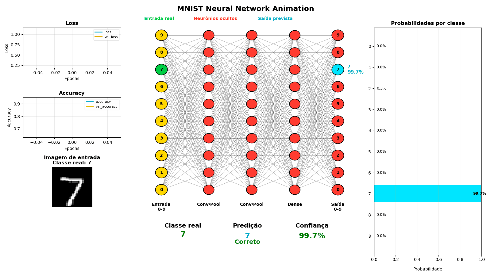
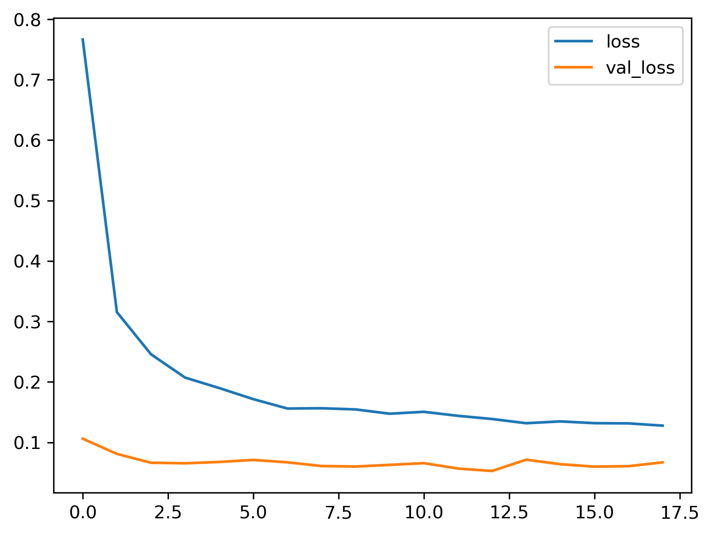
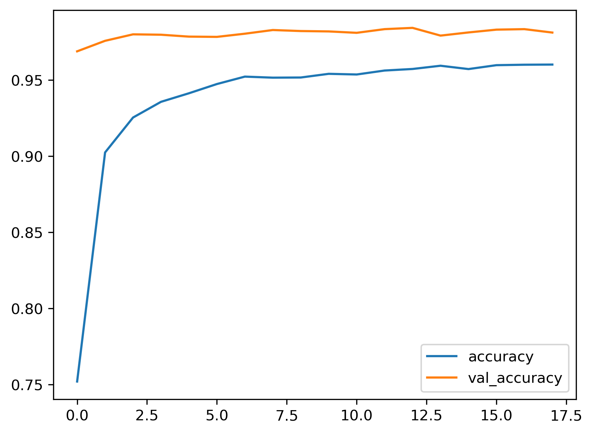
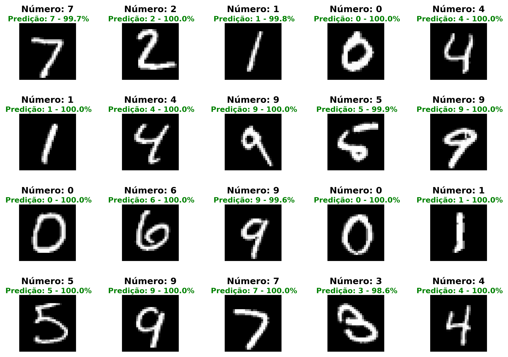
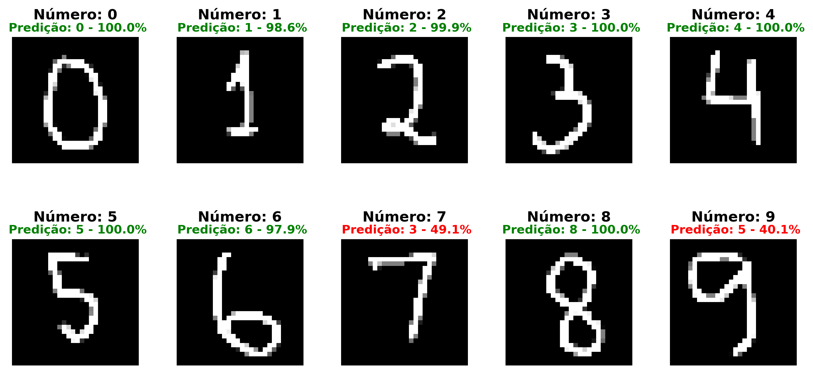

# 🔢 MNIST Handwritten Digit Recognition using Deep Learning


A complete Deep Learning project for handwritten digit recognition using the **MNIST dataset**. The project covers the entire workflow, from dataset exploration to model optimization with **Keras Tuner**, concluding with an interactive visualization of the trained neural network.

---

# 🎬 Neural Network Animation

<p align="center">

</p>

The animation illustrates the complete inference pipeline:

- Real class highlighted in **green**
- Predicted class highlighted in **cyan**
- Hidden layers represented in **red**
- Prediction confidence
- Loss and Accuracy curves
- Classification probabilities

---

# 📌 Project Overview

The objective of this project is to demonstrate the complete development cycle of a Convolutional Neural Network (CNN) for handwritten digit recognition.

The project includes:

- Dataset exploration
- CNN implementation using TensorFlow/Keras
- Performance evaluation
- Data Augmentation
- Hyperparameter optimization using Keras Tuner
- External image classification
- Interactive neural network visualization

---

# 📂 Repository Structure

```text
.
├── app.py
├── data/
├── images/
├── models/
├── notebooks/
├── requirements.txt
├── src/
└── tuner/
```

---

# 📚 Notebooks

| Notebook | Description |
|-----------|-------------|
| 01_about_the_base.ipynb | MNIST dataset exploration |
| 02_mnist_first_model.ipynb | First CNN model |
| 03_mnist_data_augmentation.ipynb | CNN with Data Augmentation |
| 04_mnist_keras_tuner.ipynb | Hyperparameter optimization using Keras Tuner |

---

# 🧠 Model Architecture

The final model consists of:

- Input Layer (28×28×1)
- Rescaling
- Random Rotation
- Random Translation
- Random Zoom
- Conv2D
- MaxPooling2D
- Dropout
- Conv2D
- MaxPooling2D
- Dropout
- Flatten
- Dense (Softmax)

---

# 🚀 Technologies

- Python
- TensorFlow
- Keras
- Keras Tuner
- NumPy
- Pandas
- Matplotlib
- Streamlit

---

# 📈 Training Curves

## Loss Function

<p align="center">

</p>

The training and validation loss decrease consistently throughout the optimization process, indicating stable convergence.

---

## Accuracy

<p align="center">

</p>

The model reaches an accuracy close to **99%**, demonstrating excellent generalization capability on unseen samples.

---

# 🔍 Predictions on MNIST Test Images

<p align="center">

</p>

The trained model successfully classifies handwritten digits with very high confidence.

---

# 🔍 Predictions on External Images

<p align="center">

</p>

The model is also capable of correctly classifying external handwritten digits after proper preprocessing.

---

# ⚙️ Installation

Clone the repository

```bash
git clone https://github.com/your_username/mnist-deep-learning-project.git
```

Create a virtual environment (optional)

```bash
python -m venv .venv
```

Install the dependencies

```bash
pip install -r requirements.txt
```

---

# ▶️ Running the Interactive Application

```bash
streamlit run app.py
```

The application displays:

- Training curves
- Input image
- Neural network representation
- Prediction confidence
- Classification probabilities

---

# 📊 Final Results

| Metric | Value |
|---------|------:|
| Test Accuracy | **98.8%** |
| Test Loss | **0.040** |

---

# 🎯 Main Concepts Covered

- Deep Learning
- Convolutional Neural Networks (CNN)
- Data Augmentation
- Hyperparameter Optimization
- TensorFlow/Keras
- Keras Tuner
- Model Evaluation
- Computer Vision
- Streamlit Dashboard
- Neural Network Visualization

---

# 👨‍💻 Author

**Dr. Flavio R. Rusch**

Data Scientist | Machine Learning | Deep Learning | Statistical Physics | Computational Modeling

GitHub: https://github.com/ruschh

LinkedIn: *(add your profile here)*

---

⭐ If you found this project useful, consider giving it a star.x
